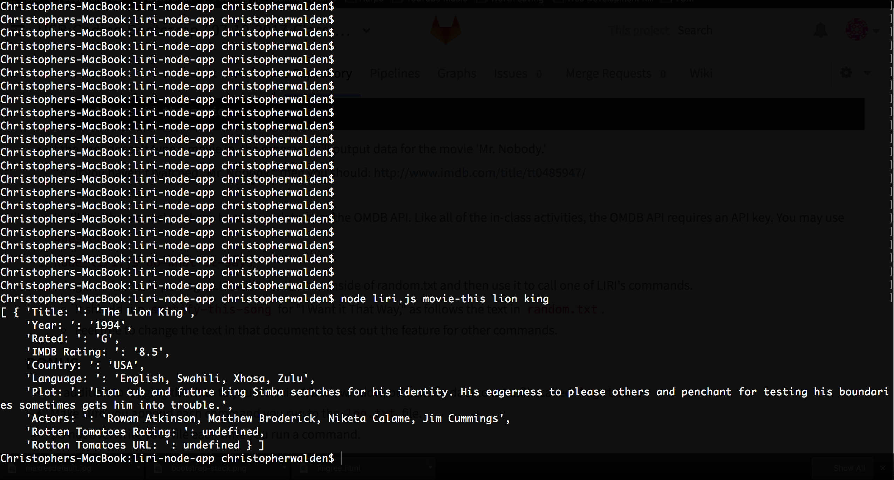

# liri-node-app

   LIRI is like iPhone's SIRI. However, while SIRI is a Speech Interpretation and Recognition Interface, LIRI is a Language Interpretation and Recognition Interface. LIRI is a command line node app that takes in parameters and gives you back data.

  node dependencies: twitter spotify request fs

  LIRI can take these commands + arguments
  <ul>
    <!-- gets my last 20 tweets -->
    <li>my-tweets</li> 
     <!-- gets song info from spotify api-->
    <li>spotify-this-song < song name here > </li>
    <!--  gets movie info from omdb api -->
    <li>movie-this < movie name here > </li> 
    <!-- reads using fs a command to run from a local file -->
    <li>do-what-it-says</li>
  </ul>

  This provided a fun oportunity to write javascript away from the browser.

